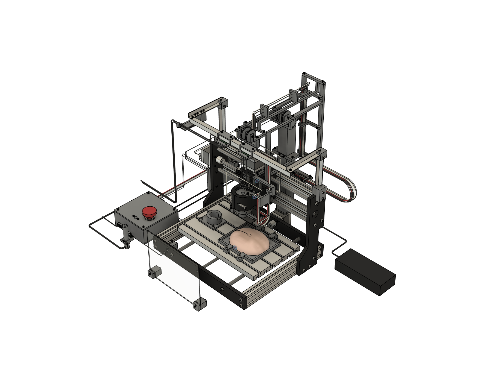

# Acuivect

### Precision Insertion Demonstrator

**Harrison B. Goldberg · Mechanical engineering portfolio · September 2026**

Digital design complete; physical build deferred due to budget. The documented parts estimate is **$489.10 before tax and shipping**. Physical construction and testing have not begun because the build budget is not yet available.

Acuivect explores XYZ motion, camera-to-tool alignment and a removable probe cartridge on a synthetic brain phantom. It is an independent portfolio project developed to demonstrate engineering skills for a Neuralink application; it has no company affiliation or endorsement. The design uses a commercial motion-platform kit and custom mechanisms. It is a bench demonstrator, not a clinical device.

AI-assisted workflows supported the creation of this project.

## Explore the portfolio

| Document | Contents |
|---|---|
| [Portfolio PDF](documents/Acuivect-Portfolio.pdf) | Project story, specifications, verification and budget |
| [Case study](documents/case-study.md) | Problem, design decisions and next stage |
| [Specifications](documents/specifications.md) | System architecture and nominal design values |
| [Validation](documents/validation.md) | Recorded digital results and their limits |
| [Budget](documents/budget.md) | Historical estimate and reason for deferring the build |
| [General assembly](drawings/Acuivect-General-Assembly.pdf) | Two native drawing sheets, public review copy |
| [Assembly and motion](drawings/Acuivect-Assembly-and-Motion.pdf) | Exploded head, assembly sequence and motion references |
| [Head structural review](analysis/Acuivect-Head-Structural-Review.pdf) | Three-page native-result reference with study assumptions |
| [Document register](documents/document-register.md) | Original document IDs, revision and public-copy notes |

## Website and GitHub

Open `index.html` for the self-contained website presentation. It uses relative asset links and requires no build service, external libraries or accounts. GitHub displays this README, Markdown documents, images and PDFs directly; its ordinary repository view does not render HTML as a website.

[Website integration instructions](website/INTEGRATION.md) and [project-entry.json](website/project-entry.json) match the existing project format used by harrisonbgoldberg.com. [portfolio.json](portfolio.json) lists the public documents and media for other renderers. This folder is prepared locally; it has not been published.

## Publication boundary

This is a selected documentation release. Editable CAD, exchange geometry, meshes, printer files, fabrication drawings, detailed wiring schedules, complete parameter/coordinate registers, automation, credentials and full engineering-delivery archives are excluded. The private engineering set includes 87 native drawing sheets; only the four assembly-level sheets and the three-page analysis reference are included here.

Public drawings and images can still be copied; withholding design sources reduces disclosure but is not copy protection. [Rights and use](RIGHTS.md). Original engineering files remain unchanged.
