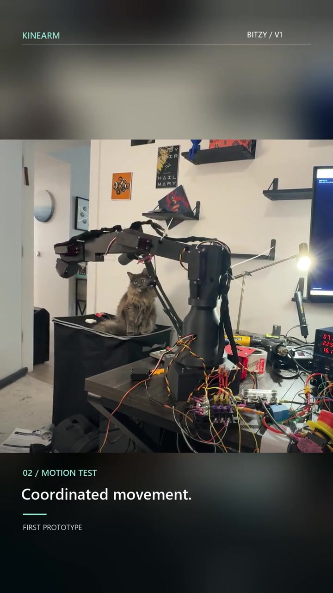

# Bitzy V1

### Modular Robotic Arm

**Harrison B. Goldberg / June 2026 - Present**

Built prototype; control refinement and physical qualification ongoing. The current five-axis arm is built and moving. Its latest gripper and screwdriver CAD revisions have completed digital checks; physical qualification remains ongoing.

AI-assisted workflows supported the creation of this project.

## Explore

| Document | Contents |
|---|---|
| [Public page](index.html) | Project overview, review documents and demonstration media |
| [Portfolio PDF](documents/Bitzy-V1-Portfolio.pdf) | Story, specifications, validation and budget |
| [Assembly review](drawings/Bitzy-V1-Assembly-Review.pdf) | Physical assembly and historical sketches |
| [Tooling review](drawings/Bitzy-V1-Tooling-Review.pdf) | Gripper Rev B and screwdriver R2 |
| [Control and validation](analysis/Bitzy-V1-Control-and-Validation.pdf) | Architecture, recorded results and next tests |
| [Case study](documents/case-study.md) | Design decisions and physical prototype |
| [Specifications](documents/specifications.md) | Nominal references with revision labels |
| [Validation](documents/validation.md) | Evidence and limitations |
| [Budget](documents/budget.md) | Partial historical quotes; full cost not reconciled |
| [Document register](documents/document-register.md) | Public-copy provenance and revision scope |

## Release boundary

Public documentation only. Editable CAD, neutral geometry, print meshes, manufacturing drawings, detailed wiring, firmware/controller source, calibration, saved positions, internal logs and full delivery archives remain private. The original engineering files are unchanged. [Rights and use](RIGHTS.md).

[Website integration](website/INTEGRATION.md), [project entry](website/project-entry.json) and [portfolio.json](portfolio.json) support the existing portfolio and standalone hosting. The stable site project ID is kinearm. The separate motor-driven arm is planning work, excluded from V1 results.
