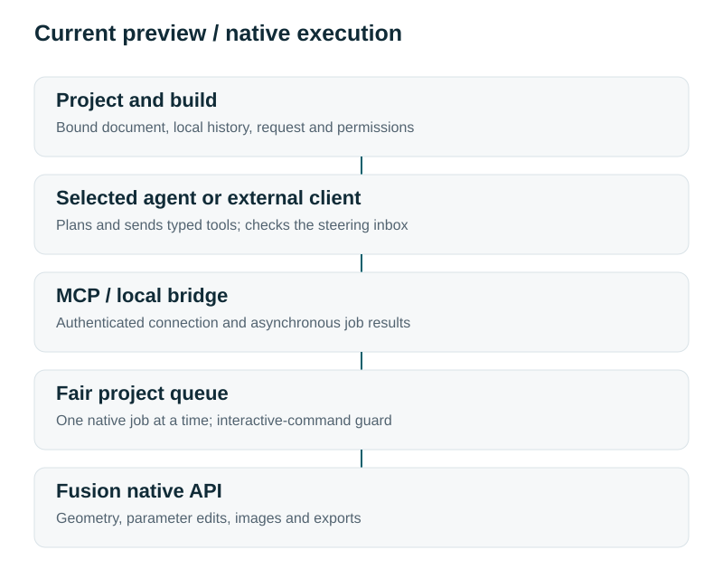
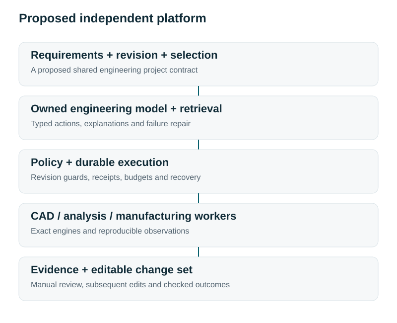

# Formivect: conversation connected to engineering work

**Personal preview 0.2.0 verified on Windows. Independent platform proposed.**

## Project intent

Formivect is Harrison B. Goldberg's engineering-software project, begun in September 2026. The current application is a local Fusion add-in with native API execution, CLI/MCP tools, project-bound queues, histories, permissions, viewport images and selected-model agent runs. Its purpose is to keep an agent connected to the actual editable design and the user's ongoing work.

## Current architecture

Requests belong to a project and build. An explicit binding targets an open Fusion document. The local bridge validates tool inputs, queues a native operation and exposes its eventual result. Jobs wait for active interactive commands; native changes serialize and the prior document is restored when possible. Agents can plan concurrently, but the preview does not create independent headless Fusion instances.

## Working evidence

The September 10 Windows record includes 37 automated checks, 17 MCP tools, 11 extended native checks, two-design geometry/viewport/export tests and actual Codex runs. A later scoped advanced-Python workflow produced 12 native solids, 36 features and 36 sketches, native export/reopen verification and 12 STL exports. Other project tools supplied downstream QA; this is not broad CAD/CAM/simulation parity.

## Independent platform ambition

The intended final product owns the engineering workspace, exact project/revision representation, CAD/analysis/manufacturing execution and deployed engineering-model route. Manual and agent edits would share the same command system. Requirements and revision-matched evidence would remain connected to the editable design.

## Next stage

Choose a useful recurring workflow and freeze an independently evaluated contract. Build missing typed operations and recovery, establish model baselines, curate permissioned data and evaluate specialization before expanding supported engineering breadth. A mounting-plate change order is a candidate; it is not a selected market or shipped standalone workflow.

AI-assisted workflows supported the creation of this project. My Python work is carried out entirely through AI-assisted workflows using Claude Code and Codex.
